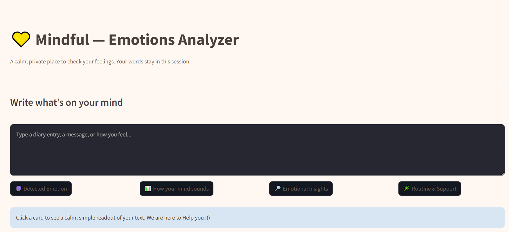

##Emotions Analyzer and Support System App
-An app that predict emotions and gives a gentle guide based on it. 
-Currently the app contains only 4 label classified into depression, suicide, anxiety and calm/neutral. 
-The app detect the texting into this four labels, analyzes them and give a gentle routine and clinical insights based on it.

##Files
-app.py
-requirements.txt
-runtime.txt
-tfidf_vectorizer.pkl
-mental_health_model.pkl

##How to run
Just Install the requirements and run: streamlit run app.py

##Screenshot

##About Mindful- Emotions Analyzer
-Type a text in the text box
-Click on those four buttons (Detected Emotion, How your mind sounds, Emotional Insights, Routine Support)
-Detected Emotion tab with detect emotions into any label from this four (depression, suicide, anxiety, calm/neutral)
-How your mind sound is a tab which shows bar chart of how your mind sounds.
-Emotional Insights tab provide a quick insights on word count, tone, note.
-Routine & Support tab gives gentle routine as well as clicinal insights base don the text you entered.
-The app also contains session download button. It downloads the session into txt format.
-The interface is simple yet interactive.

##Future Scope
-Adding user login feature
-More labels than just depression, suicide, axiety and calm/neutral.
-Giving more personalized clinical insights and routine.
-Can perfom for larger dataset.

#Streamlit App Link: https://emotions-analyzer-app.streamlit.app/

#CONTACT INFO:
•💌 wanna connect? : Linkdin- https://www.linkedin.com/in/kshitija-nikale-9935122b1/  Email - kshitijanikale4@gmail.com
